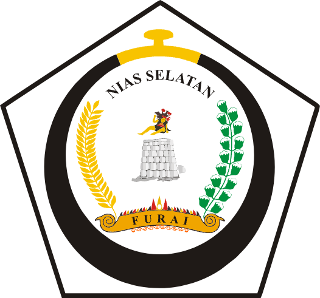

# 🏫 SISP - Sistem Informasi Sarana dan Prasarana

<div align="center">



**Sistem Informasi Sarana dan Prasarana SMP di Kabupaten Nias Selatan**

[](https://nextjs.org/)
[](https://www.typescriptlang.org/)
[](https://prisma.io/)
[](https://postgresql.org/)
[](https://tailwindcss.com/)

[🌐 Live Demo](https://sisp.blastify.tech) • [📖 Documentation](#dokumentasi) • [🚀 Getting Started](#getting-started)

</div>

---

## 📋 Deskripsi

SISP (Sistem Informasi Sarana dan Prasarana) adalah platform digital yang dikembangkan untuk Dinas Pendidikan Kabupaten Nias Selatan. Sistem ini dirancang untuk melakukan pendataan, pengelolaan, dan monitoring sarana prasarana sekolah menengah pertama (SMP) secara terpusat dan terdigitalisasi.

### 🎯 Tujuan Utama

- **Pendataan Digital**: Mengubah sistem pendataan manual menjadi digital
- **Monitoring Real-time**: Memantau kondisi sarana prasarana secara berkala
- **Pelaporan Otomatis**: Menghasilkan laporan komprehensif dan analitik
- **Transparansi**: Meningkatkan transparansi dalam pengelolaan aset pendidikan
- **Efisiensi**: Mengoptimalkan alokasi dan pemanfaatan sumber daya

## ✨ Fitur Utama

### 🏢 Manajemen Sekolah
- Pendaftaran dan profil sekolah lengkap
- Data kepala sekolah dan kontak
- Informasi lokasi dan geografis
- Status akreditasi dan operasional

### 📊 Inventarisasi Sarana Prasarana
- **Sarana**: Peralatan dan perlengkapan pendidikan
- **Prasarana**: Bangunan dan infrastruktur sekolah
- Kondisi dan status kepemilikan
- Dokumentasi visual (foto)
- Riwayat pemeliharaan

### 👥 Manajemen Pengguna
- Multi-role system (Admin, User, Reviewer)
- Sistem persetujuan akun
- Kontrol akses berbasis peran
- Audit trail aktivitas

### 📈 Analitik dan Pelaporan
- Dashboard statistik real-time
- Laporan kondisi sarana prasarana
- Export data ke PDF
- Visualisasi data interaktif

### 🔍 Sistem Review
- Verifikasi data oleh reviewer
- Workflow persetujuan bertingkat
- Komentar dan catatan review
- Notifikasi status review

## 🛠️ Teknologi yang Digunakan

### Frontend
- **Next.js 15** - React framework dengan App Router
- **TypeScript** - Type-safe JavaScript
- **Tailwind CSS** - Utility-first CSS framework
- **Radix UI** - Accessible component library
- **Lucide React** - Icon library
- **React Hook Form** - Form validation
- **Sonner** - Toast notifications

### Backend & Database
- **Prisma ORM** - Database toolkit
- **PostgreSQL** - Primary database
- **Better Auth** - Authentication system
- **Argon2** - Password hashing
- **Rate limiting** - API protection

### Development & Deployment
- **Turbopack** - Fast bundler
- **ESLint** - Code linting
- **Release Please** - Automated versioning
- **Docker** - Containerization

## 🚀 Getting Started

### Prerequisites

- **Node.js** (v18 atau lebih baru)
- **npm/yarn/pnpm** 
- **PostgreSQL** database
- **Git**

### Instalasi

1. **Clone repository**
   ```bash
   git clone https://github.com/nestorzamili/sisp-nisel.git
   cd sisp-nisel
   ```

2. **Install dependencies**
   ```bash
   npm install
   # atau
   yarn install
   # atau
   pnpm install
   ```

3. **Setup environment variables**
   ```bash
   cp .env.example .env.local
   ```

4. **Setup database**
   ```bash
   # Generate Prisma client
   npx prisma generate
   
   # Run migrations
   npx prisma migrate dev
   
   # (Optional) Seed database
   npx prisma db seed
   ```

5. **Run development server**
   ```bash
   npm run dev
   ```

6. **Buka aplikasi**
   
   Akses [http://localhost:3000](http://localhost:3000) di browser.

## 🔐 Sistem Autentikasi

- **Registration**: Pendaftaran dengan email verification
- **Login**: Autentikasi menggunakan email/password
- **Password Reset**: Reset password via email
- **Session Management**: JWT-based session
- **Role-based Access**: Admin, User, Reviewer roles
- **Account Approval**: Admin approval untuk akun baru

## 🚀 Deployment

### Production Build

```bash
# Build aplikasi
npm run build

# Start production server
npm start
```

### Docker Deployment

```bash
# Build image
docker build -t sisp-nisel .

# Run container
docker run -p 3000:3000 sisp-nisel
```

### Environment Variables Production

```env
NODE_ENV=production
DATABASE_URL="your-production-database-url"
BETTER_AUTH_SECRET="your-production-secret"
BETTER_AUTH_URL="https://sisp.blastify.tech"
```

## 🧪 Testing

```bash
# Run tests
npm test

# Run tests in watch mode
npm run test:watch

# Run e2e tests
npm run test:e2e
```

## 📊 Monitoring & Analytics

- **Performance**: Web Vitals monitoring
- **Error Tracking**: Automated error reporting
- **Usage Analytics**: User behavior tracking
- **Database Metrics**: Query performance monitoring

## 🤝 Contributing

1. Fork repository
2. Create feature branch (`git checkout -b feature/amazing-feature`)
3. Commit changes (`git commit -m 'Add amazing feature'`)
4. Push to branch (`git push origin feature/amazing-feature`)
5. Open Pull Request

### Development Guidelines

- Gunakan TypeScript untuk type safety
- Follow ESLint configuration
- Write tests untuk fitur baru
- Update documentation sesuai perubahan
- Gunakan conventional commits

## 📄 License

Proyek ini dilisensikan under [MIT License](LICENSE).

## 👥 Tim Pengembang

- **Lead Developer**: [Nestor Zamili](https://nestorzamili.works)
- **Client**: Dinas Pendidikan Kabupaten Nias Selatan

## 📞 Kontak & Support

- **Website**: [https://sisp.blastify.tech](https://sisp.blastify.tech)
- **Email**: support@sisp.blastify.tech
- **Documentation**: [Dokumentasi Lengkap](#)
- **Issues**: [GitHub Issues](https://github.com/nestorzamili/sisp-nisel/issues)

---

<div align="center">

**Dibuat dengan ❤️ untuk kemajuan pendidikan di Kabupaten Nias Selatan**

*Copyright © 2025 Dinas Pendidikan Kabupaten Nias Selatan*

</div>
